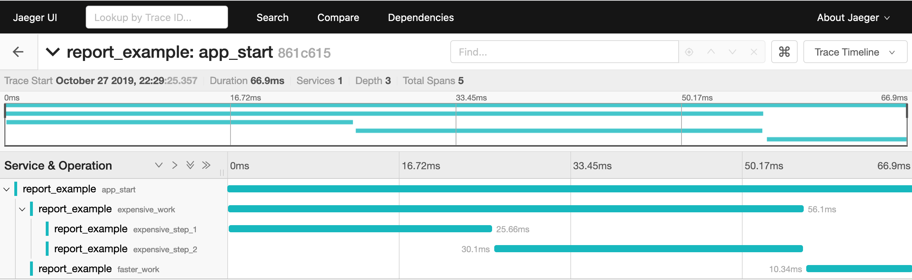

# Tracing Opentelemetry

[](https://crates.io/crates/tracing-opentelemetry)
[](https://docs.rs/tracing-opentelemetry)
[](LICENSE.txt)

An opentelemetry layer for the [tracing] library.

[tracing]: https://github.com/tokio-rs/tracing

## Tracers

Currently supports the Jaeger tracer via [rustracing_jaeger]

[rustracing_jaeger]: https://github.com/sile/rustracing_jaeger

Examples
--------

### Basic Usage

```rust
#[macro_use]
extern crate tracing;

use opentelemetry::{api::Provider, sdk};
use tracing_opentelemetry::OpentelemetryLayer;
use tracing_subscriber::{Layer, Registry};

fn main() {
    // Create a new tracer
    let tracer = sdk::Provider::default().get_tracer("component_name");

    // Create a new tracing layer
    let layer = OpentelemetryLayer::with_tracer(tracer);

    let subscriber = layer.with_subscriber(Registry::default());

    // Trace executed code
    tracing::subscriber::with_default(subscriber, || {
        let root = span!(tracing::Level::TRACE, "app_start", work_units = 2);
        let _enter = root.enter();

        error!("This event will be logged in the root span.");
    });
}
```

### Executes `report.rs` example

```console
# Run jaeger in background
$ docker run -d -p6831:6831/udp -p6832:6832/udp -p16686:16686 jaegertracing/all-in-one:latest

# Report example spans
$ cargo run --example report

# View spans (see the image below)
$ firefox http://localhost:16686/
```



References
----------

- [OpenTelemetry](https://opentelemetry.io/)